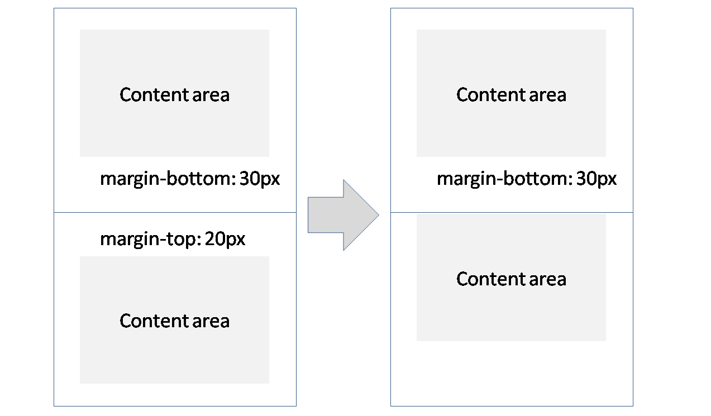
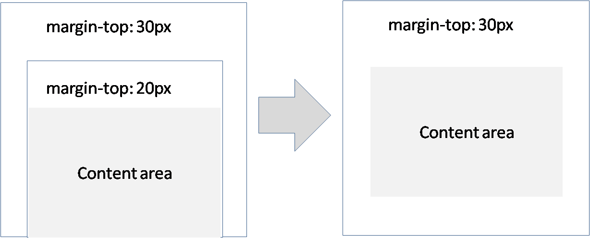
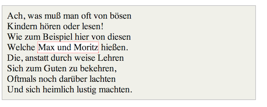
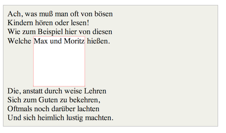
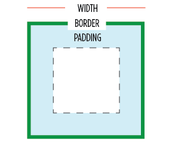

# Origin
There has been a lot of discussion about the fact that HTML wasn't designed for web apps. HTML provides two general purpose primitive tags `div` and `span` and then a *whole lot of CSS* to style and layout this and other tags to your hearts content. But lets take a step back and imagine how a framework *desgined for application layouts* would look like.

Here's how this book will do it:

## Not another CSS details book
This book isn't about making you awesome at passing the next CSS interview. This book is focused on arming you with the tools that will allow you to create great maintainable applications. This also means that if some CSS property is unintuitive (or unmaintainable at scale) it will not be covered.

# Fundamental concepts
There is very little fundamental knowledge you need. You really only need to know the difference between `margin` (something that's outside) and `padding` (something that is inside). Here's a picture:


## Margin is the enemy
One more thing about margin : *it collapses*. This means that if two items are next to each other with a margin of `30px` and `20px`, instead of of being separated by `50px` they will be separated by `30px`. This shown below:



Not only that, if an element is unfortunate to be at the border of its parent, its margin will collapse with its parent. These facts are shown below:



This makes it very difficult to create a maintainable layout system with margins. [](TODO: We will use them *but never in a container that has padding less than the child's margin*. More on this later.)

## Inline is the enemy
Having an element as `display: inline` means that it completely ignores its height. Here is a visual difference where an element has been given a height but `inline` ignored it and `inline-block` got it.





Also you cannot CSS3 transform inline elements. So use a `span` but if there is anything fancy you need the `span` to do, be sure to `inline-block` it.

# Basic Setup
There are very few simple things about the default layout of an HTML page that need to be setup in order to prepare it for the application era:

* Full Sized Body
* Box Model

## Full Sized Body
You really want the root of your page to be something that takes up all the available space on screen and provides it as a drawing canvas for children. This can be done easily:

```css
html, body {
    height: 100%;
    width: 100%;
    padding: 0px;
    margin: 0px;
}
```

## Box Model
You really want the `width`/`height` of an element to represent the `border+padding+content`. This is shown below:



It sounds something basic but the first HTML spec got wrong. Its easy to fix though:

```css
html {
  box-sizing: border-box;
}
*, *:before, *:after {
  box-sizing: inherit;
}
```

# Flexibility
Having well defined semantics of *how the layout will happen* is important for a maintainable layout system. The more variables you throw into the semantics the less reliable the layout becomes because *you need to compile the final result in your brain* in order to maintain the layout. We will cover the *concept* of a flexible layout system inspired by a *subset* of CSS flexbox.

## Root
We will look at `flex`ible children and `content` children. These concepts exist inside a *`root`*. The root is simply the *container* that is used as a point of reference for these children.

In CSS flexbox the concept of `root` does not exist without combining it with the concept of *flex direction*. We will cover this after we look at `flex` and `content`.

> A general purpose `csx.flexRoot` does exist which is just an alias for `csx.horizontal`.

To start the layout system you would generally have something like the following:

```css
#root {
    /* Take up all the space from the parent */
    height:100%;
    width:100%;

    /* Kick start the flexible layout */
    display:flex;
}
```
So the whole page is something like:
```html
<html>
<style>
    html,
    body {
        height: 100%;
        width: 100%;
        padding: 0px;
        margin: 0px;
    }

    html {
        box-sizing: border-box;
    }

    *,
    *:before,
    *:after {
        box-sizing: inherit;
    }

    #root {
        /* Take up all the space from the parent */
        height: 100%;
        width: 100%;
        /* Kick start the flexible layout */
        display: flex;
    }
</style>

<body>
    <div id="root"></div>
    <script src="./demo/bundle.js"></script>
</body>
</html>
```

## Flex
Consider the following layout:

```
------------------------------------
|            
|
|   CONTENT
|
|
------------------------------------
```

Here the content *takes up all the available space offered by the parent*.

```
------------------------------------
|            
|            
|            
|
|   CONTENT
|
|
|
|
------------------------------------
```

The space taken by the child (content) is what is available to its children. No more, no less.

Such a child is called *flex* (`csx.flex`).

> A *flex* container has the same size as its parent.

## Content
In the previous example the child *flexed* into the parent. The only other concept we need for a child is that of *content*. **A *content* child determines its size based on the size of its content**. That is all the space it takes up in the parent. This is shown below where if the parent is too big the rest of the space is unused

```
------------------------------------
|            
|
|   CONTENT
|
|
------------------------------------
|
|   UNUSED
|
------------------------------------
```
If the parent is too small the content will overflow:

```
------------------------------------
|            
|
|   CONTENT
------------------------------------
|   OVERFLOW
|
```

> A *content* (`csx.content`) child determines its size based on the size of its content

### Flex Direction
A root has a default *main axis* of `horizontal`. This is axis in which the children are layed out. In the *cross axis* the children are by default forced to `flex`.

So there are really two roots:
* `csx.horizontal`: Lays out children horizontally based on `content` and `flexes` them vertically.
* `csx.vertical`: Lays out children vertically based on `content` and `flexes` them horizontally.
[](TODO: screens would help here)

Of-course the children can change the root's `content` and `flex` choice:
* Main Axis: `content` is default. A child can choose to `flex` in the main axis.
* Cross Axis: `flex` is default. If the child has an explicit size (`width` or `height` depending on flex direction) they are treated as `content`.

# Children
We've seen three types of containers : `root`, `flex`, `content`. The next step is to combine the `flex` and `content` children into a `root`.

## Vertical Example
Consider the following layout:

```
------------------------------------
|            HEADER                |
------------------------------------            
|                                  |
|             BODY                 |
|                                  |
------------------------------------
|             FOOTER               |
------------------------------------
```

Up front we know its *vertical*. Assume that we want the body to *flex* i.e. as the root becomes larger:

```
------------------------------------
|            HEADER                |
------------------------------------            
|                                  |
|                                  |
|                                  |
|             BODY                 |
|                                  |
|                                  |
|                                  |
------------------------------------
|             FOOTER               |
------------------------------------
```

In our lingo the `root` here is `vertical` that has three children:
* header: `content`
* body: `flex`
* footer: `content`

Of course the children are going to automatically flex in the cross dimension (horizontal).

## Multiple Flex Children
The `flex` children actually share the *remainder* of the space left in the `root` after all the `content` children take up the space they need. This is shown below:

```
------------------------------------
|   ContentChild
|            
|   FlexChild
|
|   FlexChild
|
|   ContentChild
------------------------------------
```
Upon expansion:

```
------------------------------------
|   ContentChild
|            
|            
|            
|   FlexChild
|
|
|
|   FlexChild
|
|
|
|   ContentChild
------------------------------------
```

Actually a flex child can decide what *flex scaling factor* (`csx.flex1`,`csx.flex2` ... `csx.flex12`) they have. So if you have

```
A: {flex1}
B: {flex2}
```
The remainder space is divided into `3` (`1 + 2`) equal parts with `1` part going to a `A` and `2` parts going to `B`.
[](TODO: image would help)

## Horizontal Example

Consider the layout:
```
-----------------------------------------
|             |           |             |
|   SIDEBAR   |    BODY   |    SIDEBAR  |
|             |           |             |
-----------------------------------------
```
Where we want to body to grow:
```
--------------------------------------------------------
|             |                          |             |
|   SIDEBAR   |             BODY         |    SIDEBAR  |
|             |                          |             |
--------------------------------------------------------
```

Here we have:
* root: `csx.horizontal`
* sidebar: `csx.content`
* body: `csx.flex`
* sidebar: `csx.content`

This example should have been fairly obvious and was designed to give you a hands on experience 🌹

## Arbitrary Layout
Consider this layout:

```
--------------------------------------------------------
|                       HEADER                         |
--------------------------------------------------------
|             |                          |             |
|   SIDEBAR   |             BODY         |    SIDEBAR  |
|             |                          |             |
--------------------------------------------------------
|                       FOOTER                         |
--------------------------------------------------------
```
This is actually a layout used by lots of applications. If you think about it, its just a nesting of concepts you already know `csx.vertical`,`csx.horizontal`, `csx.flex`, `csx.content`.

In fact its a combination of the first layout:

```
------------------------------------
|            HEADER                |
------------------------------------            
|                                  |
|             BODY                 |
|                                  |
------------------------------------
|             FOOTER               |
------------------------------------
```

Where the body is itself a `csx.horizontal`:

```
-----------------------------------------------
|                    HEADER                   |
-----------------------------------------------
|             |                 |             |
|   SIDEBAR   |       BODY      |    SIDEBAR  |
|             |                 |             |
-----------------------------------------------
|                     FOOTER                  |
-----------------------------------------------
```
Easy right!

[](TODO: # Scrolling)

[](TODO: # Scrolling a sub child)

[](TODO Components: We've covered enough of layout to allow you to create basic layouts quite easily)

[](TODO: Overlays)

[](TODO: Menu)
